# screentone-converter

# Aplicación de Screentone

Una aplicación con interfaz gráfica para procesamiento de imágenes que permite a los usuarios:

* **Aplicar texturas de screentone** a regiones de imagen según rangos de color HSV detectados.
* **Inspeccionar valores de color a nivel de píxel** mediante un visor interactivo.

Esta herramienta está diseñada pensando en la accesibilidad, útil para tareas como estilización de imágenes, renderizado artístico o visualización adaptativa.

---

## 🖼 Características

* **Segmentación de color** basada en HSV
* Superposición dinámica de **patrones** (rayas, puntos, grillas)
* **Escalado ajustable** de patrones según el tamaño de imagen
* **Combinación alfa** para superposición no destructiva
* Inspector interactivo de **nombres de color** (nombre CSS3 más cercano)
* Menús GUI para navegación sencilla

---

## 📁 Estructura del Proyecto

```
screentone_app/
 ├── __init__.py
 ├── main.py                  # Lanzador del menú principal
 ├── image_loader.py          # Carga de imágenes
 ├── color_ranges.py          # Rangos HSV por color
 ├── patterns.py              # Generadores de texturas de screentone
 ├── screentone_processor.py  # Lógica principal del screentone
 ├── screentone_gui.py        # Ejecuta la GUI del screentone
 ├── color_inspector.py       # Herramienta para inspección de color
 ├── color_inspector_gui.py   # Interfaz para lanzar el inspector
 └── requirements.txt         # Dependencias
```

---

## ▶️ Cómo Ejecutar

1. **Instalar dependencias**:

```bash
pip install -r requirements.txt
```

2. **Iniciar la aplicación**:

```bash
python screentone_app/main.py
```

---

## 💡 Ejemplo de Uso

### 1. Aplicar Screentone

* Abrir una imagen.
* La app detecta regiones por color (ej. rojo, azul, verde).
* Cada región se rellena con un patrón de screentone correspondiente.
* Se guardan la imagen original, la procesada y la combinada.

### 2. Inspeccionar Colores

* Abrir una imagen.
* Mover el cursor para ver valores RGB y nombre de color más cercano.

---

## 🔁 Código de Ejemplo

```python
from screentone_app.image_loader import load_image
from screentone_app.screentone_processor import ScreentoneProcessor

img_rgb, path = load_image()
hsv = cv2.cvtColor(img_rgb, cv2.COLOR_RGB2HSV)
proc = ScreentoneProcessor(img_rgb.shape)
gray = proc.apply(hsv, img_rgb)
final = proc.superimpose(img_rgb, gray)
proc.save(img_rgb, gray, final, path)
```

---

## 🔄 Diagrama de Flujo

```mermaid
graph LR
    A[Iniciar App] --> B{Menú Principal}
    B --> C[Aplicar Screentone]
    B --> D[Inspeccionar Colores]

    C --> E[Cargar Imagen]
    E --> F[Convertir a HSV]
    F --> G[Segmentar por Color]
    G --> H[Generar Screentones]
    H --> I[Superponer en Imagen]
    I --> J[Mostrar y Guardar Resultado]

    D --> K[Cargar Imagen]
    K --> L[Mostrar Info del Cursor]
```



---

## Dependencias

```
matplotlib==3.10.1
numpy==2.2.5
opencv-python==4.11.0.86
pillow==11.2.1
webcolors==24.11.1
```

---

[Trabajo practico - Procesamiento de Imagenes - 1.pdf](https://github.com/user-attachments/files/19876551/Trabajo.practico.-.Procesamiento.de.Imagenes.-.1.pdf)

